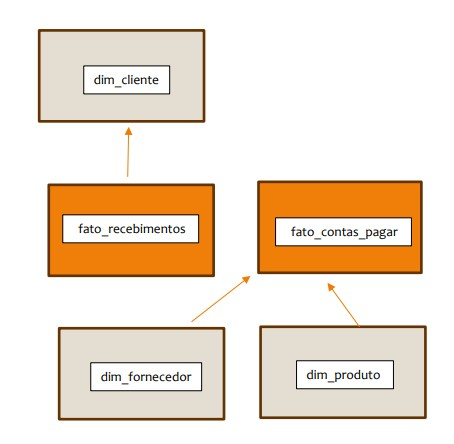
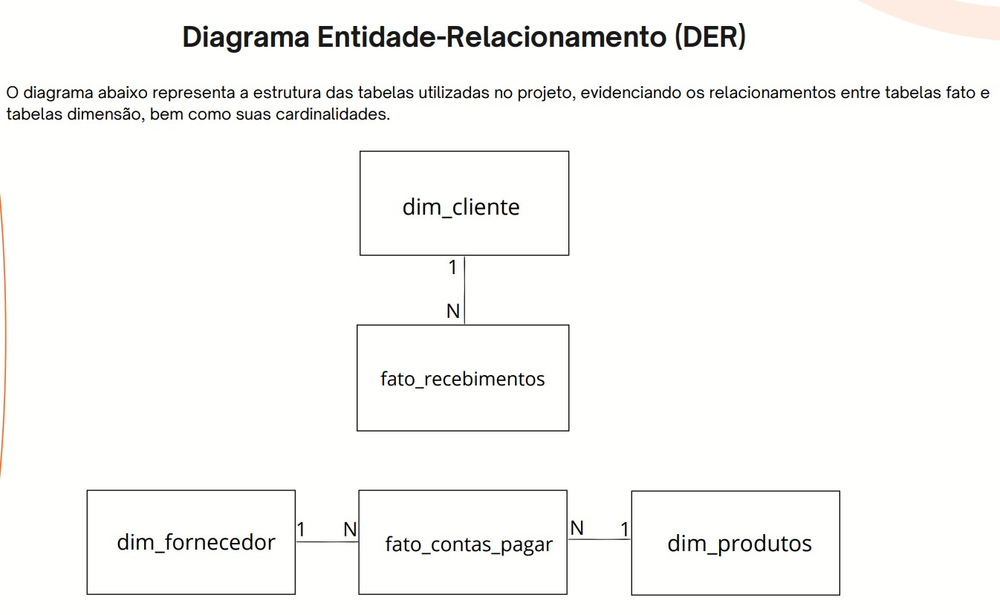
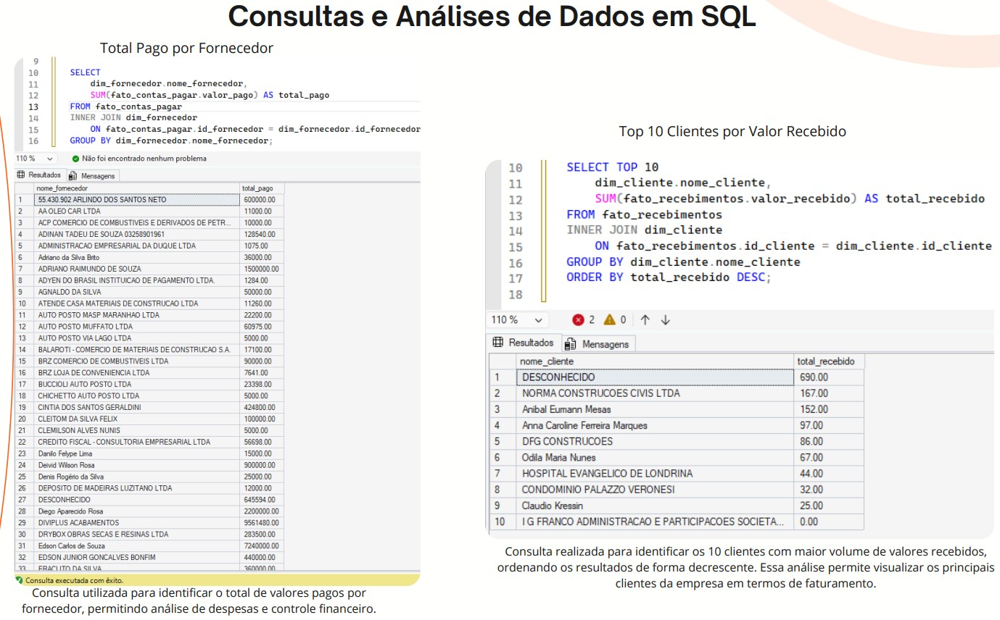

# Modelo Dimensional para Controle Financeiro

## Sobre o Projeto:

Este projeto foi desenvolvido com o objetivo de construir um modelo dimensional para controle financeiro utilizando SQL Server.

Os dados utilizados foram extraídos de um ERP do setor da construção civil, permitindo a criação de análises financeiras para apoio à tomada de decisão.

---

##  Objetivos:

- Construir um modelo dimensional utilizando esquema estrela;
- Criar tabelas fato e dimensão;
- Realizar consultas analíticas em SQL;
- Apoiar análises financeiras e geração de insights.

---

## Tecnologias Utilizadas

- SQL Server
- Modelagem Dimensional
- SQL
- GitHub

---

## Estrutura do Projeto:

```text
SQL
├── criacao_tabelas.sql
└── consultas_analiticas.sql

Imagens
├── imagem DER.jpg
├── MODELO ESTRELA - FATOS E DIMENSOES.jpg
└── consultas sql.jpg
 DER
    └── Modelo entidade relacionamento

 Imagens
    └── Prints das consultas e resultados
```

## Modelo Estrela



---

## DER - Diagrama Entidade Relacionamento



---

## Resultado das Consultas



---

##  Principais Análises:

- Total pago por fornecedor;
- Top 10 clientes por valor recebido;
- Análises financeiras para suporte à tomada de decisão.

---

##  Desenvolvido por:

**Thainara Geraldini**

Estudante de Análise e Desenvolvimento de Sistemas em transição para a área de Dados.


## Observação:

Os dados utilizados neste projeto foram extraídos de um ERP real do setor da construção civil.

Por questões de confidencialidade e proteção das informações da empresa, os dados não foram disponibilizados neste repositório.

Este projeto tem como objetivo demonstrar conhecimentos em modelagem dimensional, SQL e análise de dados.
